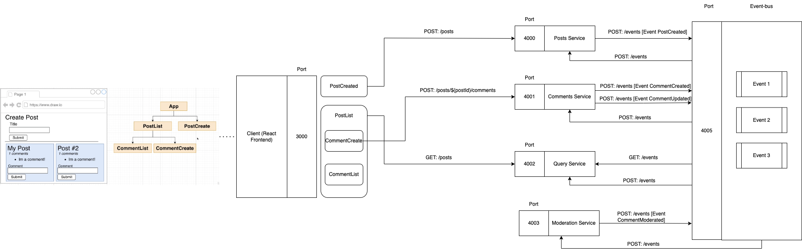
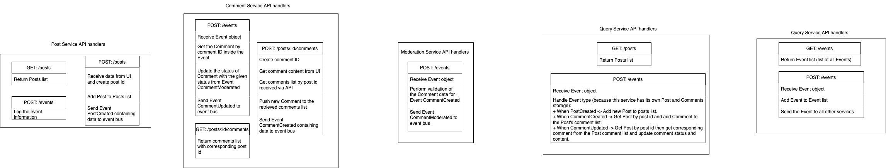
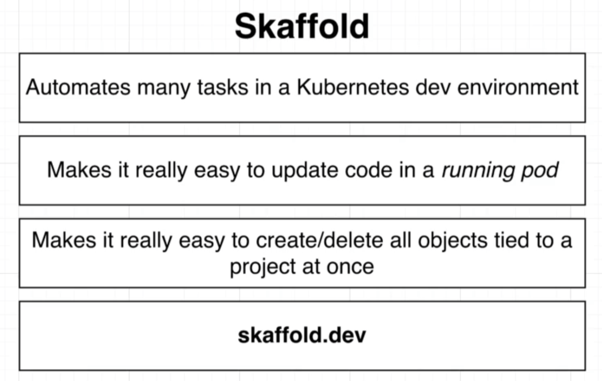

# simple-blog-app
## Working version
Node.js v14

## Simple guidelines
* Use `npm init -y` to create package.json
* Then `npm install axios express nodemon cors` to install appropriate packages. Note: some services do not need all of those packages.
* Call `npm start` to start a service

## App description
1. Posts service: 
    * Port 4000
2. Comments service: 
    * Port 4001
3. Query service: 
    * Port 4002
4. Moderation service: 
    * Port 4003
5. Event bus: 
    * Port 4005

### Flow diagram
#### General flow

#### API Handlers


## Docker commands instruction
1. `docker build -t [image_name]:[tag] .`: build up docker image in current folder. You have to go into the folder containing Dockerfile to create the image.

## Kubernetes
### Kubernetes commands instruction
1. `kubectl apply -f [config_file]`: run k8s and create pods. In our case:
    * Posts
        + `kubectl apply -f posts-depl.yaml`
        + `kubectl apply -f posts-srv.yaml`
    * Event-bus
        + `kubectl apply -f event-bus-depl.yaml`
    * To apply all at one go:
        + `kubectl apply -f .`
2. `kubectl get [object_name]`: list all running objects.
    + `kubectl get deployments`: list all running deployments.
    + `kubectl get pods`: list all running pods.
    + `kubectl get services`: list all running services.
3. `kubectl describe [obj_name] [name]`: print out details about a specific object.
    + `kubectl describe deployment posts-depl`
    + `kubectl describe service posts-srv`
    + `kubectl describe pod comments-depl-6f4f99954f-7l47x` (this is just an example, your pod name can be diffent)
4. `kubectl delete deployment [depl name]`: delete a deployment
    + `kubectl delete deployment posts-depl`
    + `kubectl delete deployment event-bus-depl`
5. `kubectl delete pod [pod name]`: delete a pod
6. `kubectl rollout restart deployment [depl name]`: to tell k8s to use the latest version of image on docker hub
    + `kubectl rollout restart deployment posts-depl`
    + `kubectl rollout restart deployment event-bus-depl`
7. `kubectl logs [pod name]`: print out the logs of the pod

#### Full script to stop
```
kubectl delete deployment posts-depl
kubectl delete deployment comments-depl
kubectl delete deployment moderation-depl
kubectl delete deployment query-depl
kubectl delete deployment event-bus-depl
kubectl delete deployment client-depl
kubectl delete service comments-srv
kubectl delete service event-bus-srv
kubectl delete service moderation-srv
kubectl delete service posts-srv
kubectl delete service query-srv
kubectl delete service client-srv
kubectl delete service posts-clusterip-srv
```


### Accessing via web browser
The service can be accessed via **localhost:3xxxx/posts**, where 3xxxxx is the NodePort of the Service object.

## Practical steps
### To build docker image (with good practice)
Use `docker build -t [YOUR-DOCKER-ID]/[IMAGE-NAME] .`. Example: `docker build -t dmnhat91/client .` (this builds image client)

### Method to update Image used by a deployment
* Step 1: The deployment must be using the 'latest' tag in the pod spec section of the .yaml file
* Step 2: Make an update to your code
* Step 3: Build the image
* Step 4: Push the image to docker hub (using command `docker push [image_name]`)
* Step 5: Run the command `kubectl rollout restart deployment [depl name]`

### Steps to create connection between services
* Step 1: Build an image for the Event Bus
* Step 2: Push the image to Docker Hub
* Step 3: Create a deployment for Event Bus
* Step 4: Create a Cluster IP service for Event Bus and Posts
* Step 5: Wire it all up!

## Ingress
### Installation
Follow: https://kubernetes.github.io/ingress-nginx/deploy/#quick-start

### Host File Tweak
You need to trick Ingress to think the domain configured in `ingress-srv.yaml` is localhost.
For MacOS/Linux:
    * Add `127.0.0.1 posts.com` to `/etc/hosts`
For Windows:
    * Add `127.0.0.1 posts.com` to `C:\Windows\System32\Drivers\etc\hosts`

### To debug Ingress
Make sure you have deployed the correct controller for Docker Desktop:

`kubectl apply -f https://raw.githubusercontent.com/kubernetes/ingress-nginx/controller-v1.1.1/deploy/static/provider/cloud/deploy.yaml`

Then, you need to check the status of the load balancer (allow a few minutes to pass before testing):

`kubectl get services -n ingress-nginx`

It should return:

NAME TYPE CLUSTER-IP EXTERNAL-IP PORT(S) AGE

ingress-nginx-controller LoadBalancer 10.98.198.86 localhost 80:31932/TCP,443:32072/TCP 19m

ingress-nginx-controller-admission ClusterIP 10.108.118.196 <none> 443/TCP 19m


## Skaffold
### Usage


You even don't need to run the above commands to create deployments and delete deployments. Skaffold does it for you.

### Installation
Follow: https://skaffold.dev/
Or just run command: `brew install skaffold`

### Config file
Skaffold will consume skaffold.yaml file at the root of project.

### Startup skaffold
* Use command: `skaffold dev`
* Use `Control + C` to stop


### Note here
With current config, when you makes changes to .JS file. Skaffold will throw the changed file to the pod. But there is actually a library "nodemon index.js" setup inside package.json to reload the newly changed files. Therefore, you can see the changes reflected. If not using any library like nodemon, it will not do anything good.