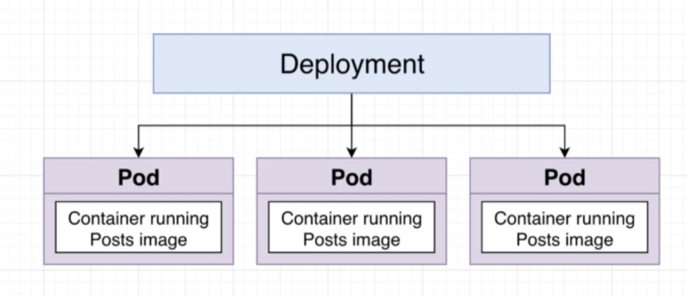
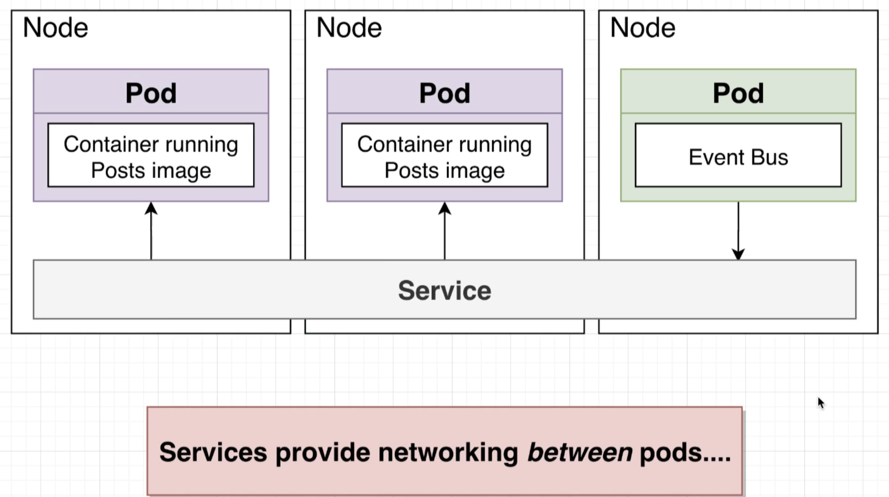
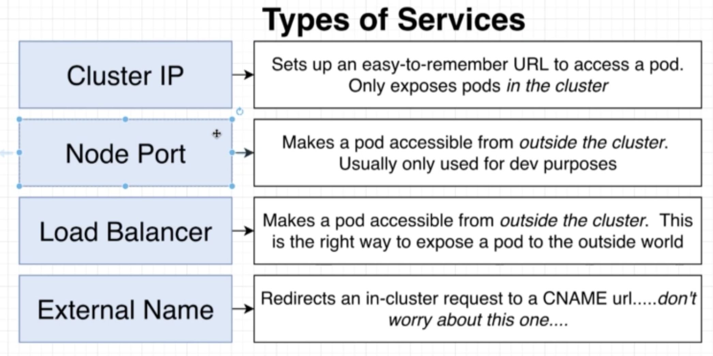
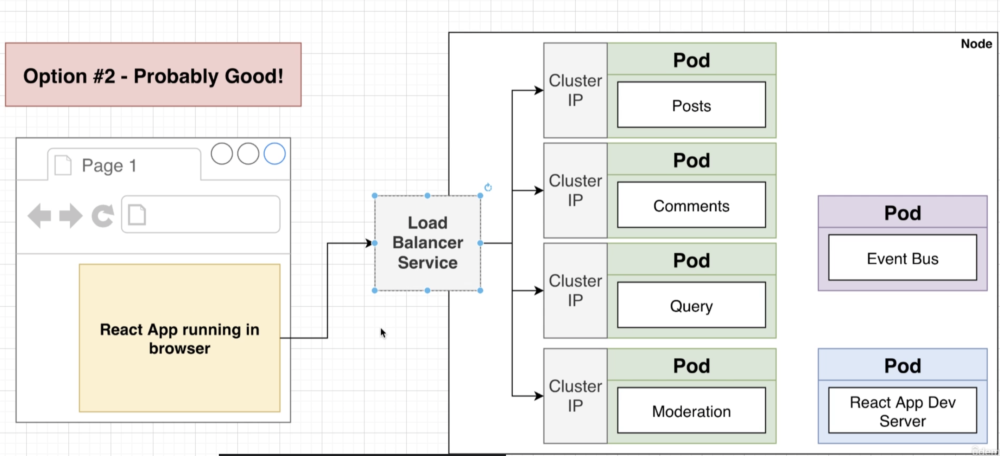
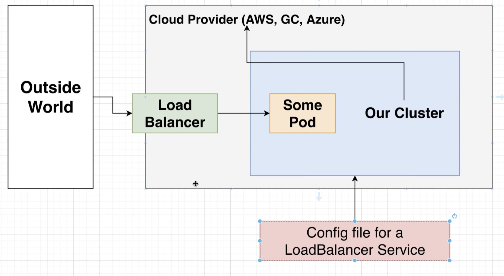
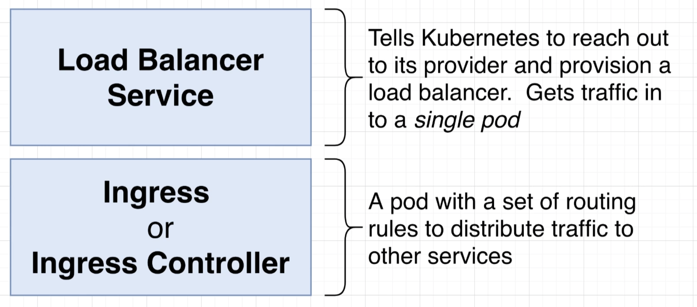
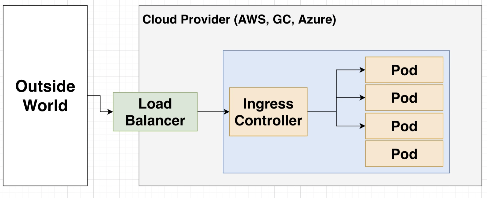
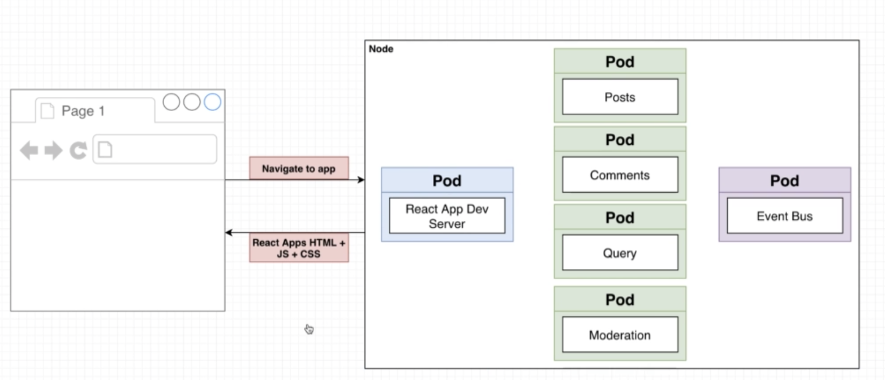
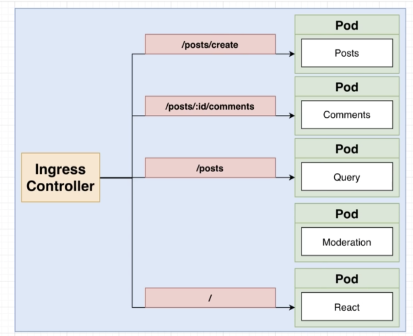

# Basic knowledge
## Deployment
A deployment is a Kubernetes object that is intended to manage a set of pods.

If somehow, there is a pod that crashes, the deployment auto creates a new pod again.
## Networking with services
A Service is another kind of object in Kubernetes.

There are different types of Service in k8.

## Load balancer

The Load balancer receives request from React App and will reach to appropriate Cluster IP Service

## Ingress

## Full Overview

## K8s routing

# Explanation of k8s configuration
## posts-srv.yaml
The selector **app: posts** tells the service to find all the different pods which have label **app: posts** and expose those pods to the outside world. You can understand this **app: posts** label thing is just like classname in HTML for a HTML tag. And then you select the tag with classname is like what the selector is for in k8s.

## event-bus-depl.yaml
Notice that if you don't specify the type of Service. K8s will default it to ClusterIP.
The seperator "---" in the file to seperate between k8s objects, because we want create multiple objs in single yaml file.